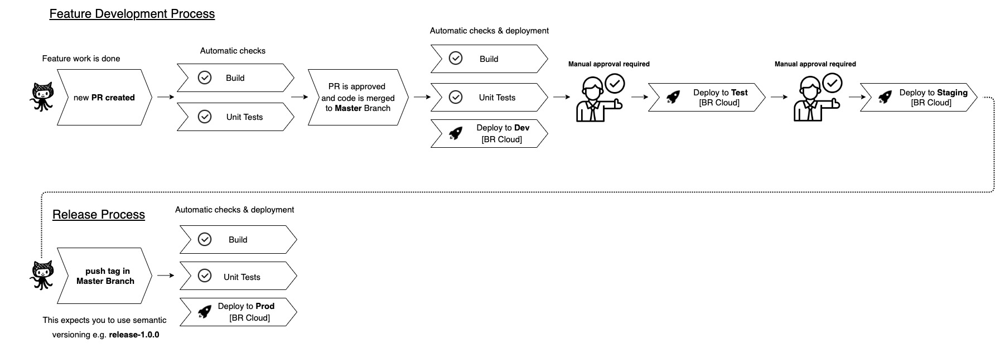

# HEE CMS Platform

The HEE CMS Platform used to manage and deliver the website at https://www.hee.nhs.uk

## Continuous Integration/Continuous Deployment Status (CI/CD)


## Built With

* [BloomReach DXP 14.7.3](http://www.bloomreach.com) - BloomReach is the content management system platform used in this project
* [brCloud](https://www.bloomreach.com/en/products/experience-manager/cloud-cms) - Bloomreach Cloud Managed Hosting

## Getting Started

These instructions will get you a copy of the project up and running on your local machine for development and testing purposes. See deployment for notes on how to deploy the project on a live system.

### Prerequisites

In order to develop on this platform you will need to have the following tools installed and configured

- IntelliJ IDEA
- Docker
- Java 1.8
- Maven >= 3.5.0 (For `Maven CI Friendly Versions` Support)


### Installing

In order to get a development environment up and running you will need to work through the following steps

Cloning the platform from source control

```
git clone https://github.com/Health-Education-England/hee-cms-platform.git
```

To run the brXM project in a docker container, you must install the project, build the docker image and run the docker image respectively.

First install the project:

```
mvn clean install
```

Note: Ensure you have an account for the Bloomreach brXM enterprise code repository and [configure](https://documentation.bloomreach.com/14/library/enterprise/enterprise-developer-information/hippo-maven-enterprise-repository-manual.html) it in your `~/.m2/settings.xml`

Then build the brXM docker image:

```
mvn -Pdocker.build
```

This maven profile will create a docker image and add it to the local docker registry. The new image will be tagged in `<group_id>/<artifactId>:<version`. Example: `uk.nhs.hee.web/hee-cms-platform:0.1.0-SNAPSHOT`

To run the image with in-memory h2 database:

```
mvn -Pdocker.run
```

Running with an embedded MySQL database. To create & run environment containing builtin MySQL DB just run:

```
mvn -Pdocker.run,docker.mysql
```

As a result, default db credentials will be used (admin/admin) and DB name will be the same as project's artifactId (e.g. myproject)

Running with an embedded PostgreSQL database. To create & run environment containing builtin PostgreSQL DB just run:

```
mvn -Pdocker.run,docker.postgres
```

As a result, default db credentials will be used (admin/admin) and DB name will be the same as project's artifactId (e.g. myproject)

To run the image with an external mysql database, add the provided database name, username and password below to the properties
section of your project's pom.xml:

```
    <docker.db.host>DATABASE_HOSTNAME</docker.db.host>
    <docker.db.port>DATABASE_PORT</docker.db.port>
    <docker.db.schema>DATABASE_NAME</docker.db.schema>
    <docker.db.username>DATABASE_USERNAME</docker.db.username>
    <docker.db.password>DATABASE_PASSWORD</docker.db.password>
```

Then run:
```
    mvn -Pdocker.run,mysql
```

After running the docker image, application logs will be shown on the terminal window.

After your project is set up, access the CMS at <http://localhost:8080/cms> and the site at <http://localhost:8080/site>. Logs are located in target/tomcat9x/logs.

## Automatic Export

Automatic export of repository changes to the filesystem is turned on by default. To control this behavior, log into <http://localhost:8080/cms/console> and press the "Enable/Disable Auto Export" button at the top right. To set this as the default for your project edit the file ./repository-data/application/src/main/resources/hcm-config/configuration/modules/autoexport-module.yaml

## Running unit tests

You can run the unit tests for the application like so:

```
mvn clean test
```

### Running integration tests

And you can run the integration tests like so:

```
mvn clean verify
```

### And coding style tests

Code style is enforced using checkstyle and uses the out of the box Sun java style configuration (i.e. sun_checks.xml). Checkstyle is run by default on any maven build that compiles source code.

You can if you wish run the code style checks independently using the following syntax:

```
mvn checkstyle:checkstyle
```

### Locations for front end prototype css and js
To manually update the css and javascript files with the those built with [HEE prototype kit](https://github.com/Health-Education-England/hee-prototypes):

 - \hee-cms-platform\repository-data\webfiles\src\main\resources\site\css\nhsuk-4.1.0.min.css
 - \hee-cms-platform\site\webapp\src\main\webapp\static\js\main.min.js

## Building a project distribution

To build Tomcat distribution tarballs:

```
mvn clean verify
mvn -P dist
```

    or

```
mvn -P dist-with-development-data
```

The `dist` profile will produce in the /target directory a distribution tarball, containing the main deployable wars and shared libraries.

The `dist-with-development-data` profile will produce a distribution-with-development-data tarball, also containing the repository-data-development jar in the shared/lib directory. This kind of distribution is meant to be used for deployments to development environments, for instance local deployments or deployments to a continuous integration (CI) system. (Initially, this module contains only "author" and "editor" example users for use in testing. Other data must be placed in this module explicitly by developers, for demo or testing purposes, etc.)

See also src/main/assembly/*.xml if you need to customize the distributions.

## Deployment

Code is deployed automatically to Bloomreach Cloud (brCloud) by the CICD process defined using github workflow actions (./github/workflows/). 

The github workflow actions are based on the following custom-made github actions:
- https://github.com/Health-Education-England/cleanup-distributions-from-BR-Cloud-action
- https://github.com/Health-Education-England/upload-distribution-to-BR-Cloud-action
- https://github.com/Health-Education-England/deploy-distribution-to-BR-Cloud-action

You can deploy to the following environments:

- **development** by merging a PR into the **master** branch
- **test** by manually promoting the code from development environment to test environment, using the github action workflow 
- **staging** by manually promoting the code from test environment to staging environment, using the github action workflow  
- **production** by creating a release tag **release-{version}** inside the **master** branch

Please check the following diagram for a better understanding of the development and delivery process:



#### GitHub Secrets

The GitHub action workflows that handle the CICD process require the following secrets to be setup on Github:
  
 - Secrets for `hippo-maven2-enterprise` maven repository (https://maven.onehippo.com/maven2-enterprise)
   - BLOOMREACH_MVN_USERNAME - brXM Maven Repository username
   - BLOOMREACH_MVN_PASSWORD - brXM Maven Repository password
   
    Contact Bloomreach ([Get Bloomreach Experience Manager Developer Accounts](https://documentation.bloomreach.com/14/about/get-bloomreach-experience-developer-accounts.html)) in order to setup a developer account.
 - Secrets to upload and deploy the distribution onto a brCloud environment
   - BRC_USERNAME - brCloud username
   - BRC_PASSWORD - brCloud password

## Environments

You can find deployments of this application in the following environments inside Bloomreach Cloud Platform(https://missioncontrol.hee.bloomreach.cloud/#/login)

| Name           | Platform  |
| -------------- | --------- |
| Development    | brCloud   |
| Test           | brCloud   |
| Staging        | brCloud   |
| Production     | brCloud   |

## Releases and Versioning

We use [SemVer](http://semver.org/) for versioning. For the releases available, see the [Releases/Tags on this repository](https://github.com/Health-Education-England/hee-cms-platform/releases).

## Authors

* Adriana Miclos
* Dawn Taroni
* Le Tho
* Raq khan
* Sankaralingam Shunmugasundaram
* Selvandhan Manivasagam
